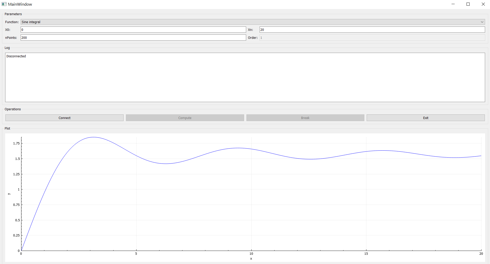

# ICS0025 - Coursework #3

## Running the app

- Please note that you must start the server separately. 
- If it is not running and you try to connect, the app will warn you.
- After clicking `Break` or `Exit`, you need to type `reset`  in the server prompt to be able to connect again.
 
## UI sample

- Care has been taken for the elements to resize with the window, and to enable/disable elements as appropriate.
  
